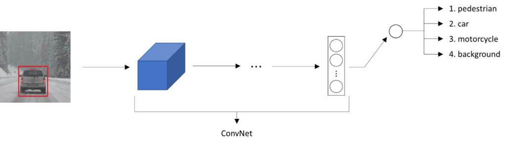
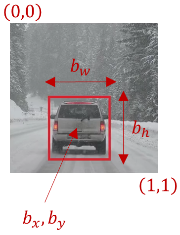



We’re already familiar with the image classification problem in which we might input a picture into a convnet with multiple layers, and this results in a vector of features that is fed to maybe a softmax unit that outputs the predicted class.

Say we’re building a self-driving car. And say, our object categories are
- a pedestrian, 
- a car, 
- a motorcycle and 
- a background (this means none of the above objects).

So, if there’s no pedestrian, no car, no motorcycle then we may have an output background. These are our four classes, so we need a softmax with 4 possible outputs.

How about if we want to localize the car in the image as well? To do that we can change our neural network to have a few more output units that output a bounding box. In particular, we can have the neural network output 4 more numbers, and those numbers will be $$ b_x, b_y, b_h, b_w $$. These 4 numbers parameterize the bounding box of the detected object.

# Classification with localization
Here is used the notation that the upper left point of the image is $$(0,0)$$, lower right is $$(1,1)$$.

Specifying the bounding box the red rectangle requires specifying 
- the midpoint, the point $$ b_x, b_y $$
- the height, $$ b_h $$ and 
- the width, $$ b_w $$ of this bounding box 

Now if our training set contains not just the object class label, which our neural network is trying to predict up here, but it also contains 4 additional numbers giving the bounding box, then we can use supervised learning to make our algorithm outputs not just a class label, but also the 4 parameters to tell us where is the bounding box of the object we detected.

# Defining the target label $$y$$

We can formalize the target label $$y$$ as follows,

$$ y=\begin{bmatrix} p_{c}\\ b_{x}\\b_{y}\\b_{h}\\b_{w}\\c_{1}\\c_{2}\\c_{3}\end{bmatrix} $$

where,
- $$p_c$$ stands for the probability that there’s a object, 
    - 1 for a pedestrian, a car or a motorcycle
    - 0 for background (i.e., none)
- $$ b_x, b_y, b_h, b_w $$ is our bounding box
- $$c_1$$ is 1 if a padestrian, 0 otherwise
- $$c_2$$ is 1 if a car, 0 otherwise
- $$c_3$$ is 1 if a motorcycle, 0 otherwise

# Example

For the image on the left (one with the car), our $$y$$ could be written as follows,

$$y= \begin{bmatrix}1\\b_{x}\\b_{y}\\b_{h}\\b_{w}\\0\\1\\0 \end{bmatrix}$$

For the image on the right (which has no objects), our $$y$$ could be written as follows,

$$y=\begin{bmatrix}0\\?\\?\\?\\?\\?\\?\\? \end{bmatrix}$$

$$?$$ is used to represent values that we don't care. If there is no object, it doesn't matter what rest of the value in the $$y$$ are.

# Loss function

All vector elements matter if there is an object
$$ L\left ( \hat{y},y \right )=\left ( \hat{y}_{1}-y_{1} \right )^{2}+\left ( \hat{y}_{2}-y_{2} \right )^{2}+…+\left ( \hat{y}_{8}-y_{8} \right )^{2},   y_{1}=1 $$

If no object, let's count only the first one ($$p_c$$), rest of the values don't matter
$$L\left ( \hat{y},y \right )= \left ( \hat{y}_{1}-y_{1} \right )^{2}, y_{1}=0$$

# References
- Deeplearning.ai's Convolution Neural Network course
- http://datahacker.rs/deep-learning-object-localization/