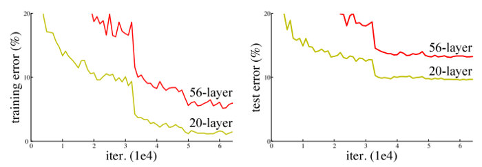
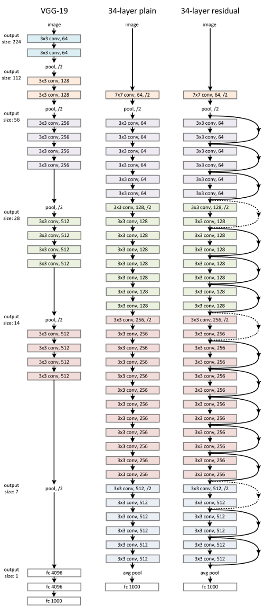



You should read about [Vanishing/Exploding Gradients](https://towardsdatascience.com/the-vanishing-gradient-problem-69bf08b15484) before you start this article.

In theory, very deep networks can represent very complex functions; but in practice, they are hard to train.

ResNet makes it possible to train up to hundreds or even thousands of layers and still achieves compelling performance.

Taking advantage of its powerful representational ability, the performance of many computer vision applications other than image classification have been boosted, such as object detection and face recognition.

# The problem of very deep neural networks

According to the universal approximation theorem, given enough capacity, we know that a feedforward network with a single layer is sufficient to represent any function. However, the layer might be massive and the network is prone to overfitting the data. Therefore, there is a common trend in the research community that our network architecture needs to go deeper. 

The main benefit of a very deep network is that it can represent very complex functions. It can also learn features at many different levels of abstraction, from edges (at the shallower layers, closer to the input) to very complex features (at the deeper layers, closer to the output).

Since AlexNet, the state-of-the-art CNN architecture is going deeper and deeper. While AlexNet had only 5 convolutional layers, the VGG network and GoogleNet (also codenamed Inception_v1) had 19 and 22 layers respectively.

However, deep networks are hard to train because of the notorious vanishing gradient problem. Huge barrier to training them is [vanishing gradients](./vanishing-gradient-problem): very deep networks often have a gradient signal that goes to zero quickly, thus making gradient descent prohibitively slow. More specifically, during gradient descent, as you backprop from the final layer back to the first layer, you are multiplying by the weight matrix on each step, and thus the gradient can decrease exponentially quickly to zero (or, in rare cases, grow exponentially quickly and "explode" to take very large values).

In the above figure you can see that `the speed of learning decreases very rapidly for the shallower layers as the network trains`.

So, it might seem that the shallower networks are learning better than their deeper counterparts. This is quite counter-intuitive, but this is what is seen in practice and is popularly known as the degradation problem.

# Residual Networks

Before ResNet, there had been several ways to deal the vanishing gradient issue, but none seemed to really tackle the problem once and for all.

The core idea of ResNet is introducing a so-called “identity shortcut connection” that skips one or more layers, as shown in the following figure:

The authors of the paper that proposed residual networks argue that stacking layers shouldn’t degrade the network performance, because we could simply stack identity mappings (layer that doesn’t do anything) upon the current network, and the resulting architecture would perform the same. This indicates that the deeper model should not produce a training error higher than its shallower counterparts. They hypothesize that letting the stacked layers fit a residual mapping is easier than letting them directly fit the desired underlaying mapping. And the residual block (shown in the above image) explicitly allows it to do precisely that.

`In traditional neural networks, each layer feeds into the next layer. In a network with residual blocks, each layer feeds into the next layer and directly into the layers about 2–3 hops away`

Note how in the figure above, the last step it taking the regular input $$ F(X) $$  and also the input from shortcut connection which is $$ X $$, thus making the resulting input $$ F(X)+X $$.

# References
Contents of this article are taken from

- [Deep Residual Learning for Image Recognition, Research Paper](https://arxiv.org/pdf/1512.03385.pdf)
- [Deeplearning.ai's Convolution Neural Network Course](https://www.coursera.org/learn/convolutional-neural-networks/)
- [An Overview of ResNet and its Variants, Blog by tds](https://towardsdatascience.com/an-overview-of-resnet-and-its-variants-5281e2f56035)
