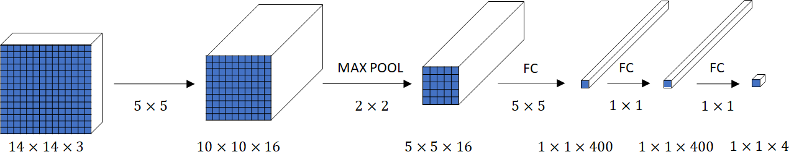
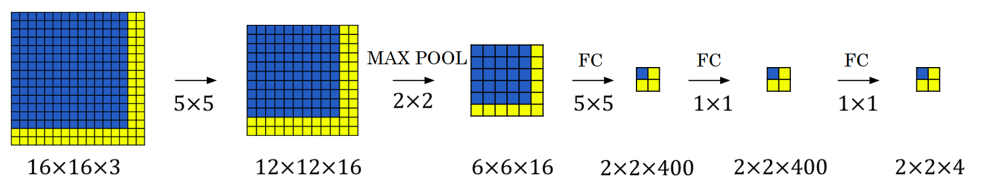



We have learned about [object localization](./object-localization) as well as [landmark detection](./landmark-detection), now let’s build an object detection algorithm. 
In this post we’ll learn how to use a convnet to perform object detection using **Sliding Windows Detection Algorithm**.

Let’s say we want to build a car detection algorithm.

1. We can first **_create a labelled training set (x,y) with closely cropped examples of cars_** and some other pictures that aren’t pictures of cars. We want to cut out such that we end up with a car centered in pretty much the entire image. Given this labelled training set we can then train a Convnet to classify an image as a car ($$y=1$$) or not ($$y=0$$).

2. **_Select a certain small window size._**

3. **_Put that window on the beginning of your test image. Classify the image inside the window a car ($$y=1$$) or not ($$y=0$$)_**, using the ConvNet that we trained in the previous step.

4. **_Shift your window and classify the new image inside the window._** Keep doing this until you cover the entire test image.

5. **_Increase the window size and repeat step 3 and 4_**. That is, classify the image inside the window, shift, classify again, so on and on.

6. **_Repeat step 5 until either you find an object or your window size is as big as the test image itself_**.

# Disadvantages of Sliding Window Detection
-  Because we’re cropping out so many different square regions in the image and running each of them independently through a convnet, it requires _High Computational power_, making it an expensive and slow algorithm. 

# Faster and More efficient
Say, our window is somewhere on the test image. Let's call the image inside the window at this moment, **A**. Now, move the window to the next location and call the image inside the window at this moment **B**. Depending on our strides, there could be many pixels that common amongst both of these images. Based on that there could also be many repeated computation happening when we classify these two images.
So, clearly there is a room for making this algorithm more efficient. Let's try to do that.

If you notice, a window in Sliding Window Detection Algorithm and a filter in a convolutional operation are very similar. They both move through an image and perform operations on pixels under them.

There is a way to classify all possible images under a window in just a single operation.

Let’s say size of the window is $$14×14$$. And to classify images in a sliding window, we have a convnet inputs $$14×14×3$$ images and eventually outputs a $$1×1×4$$ volume. We can see the implementation of this neural network in the following picture. 

Say, our full test image is $$16×16×3$$. If we slide our window through this image, it would result in 4 different images to classify. Instead of doing them separately, we could just use the convnet that we used for a single image under a window. This would result in a $$2×2×4$$ volume. Each $$1×1×4$$ volume in this $$2×2×4$$ volume represents the classification of it's corresponding $$14×14×3$$ sliding window image.

# References
- Deeplearning.ai's CNN Course