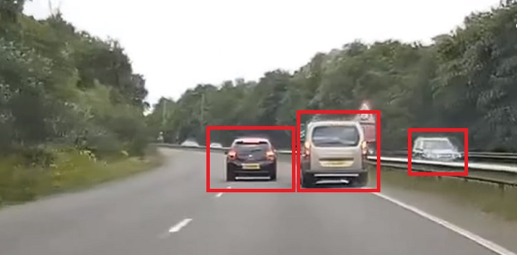
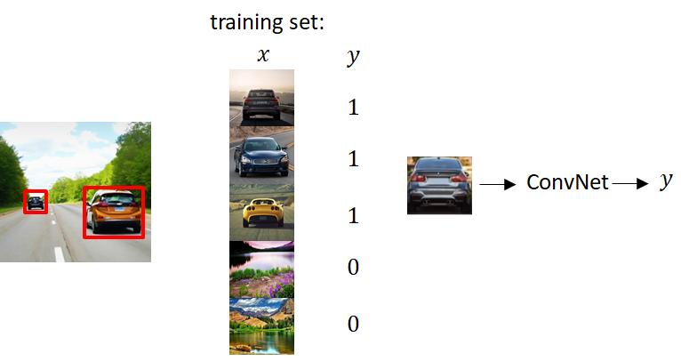
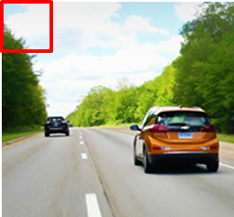
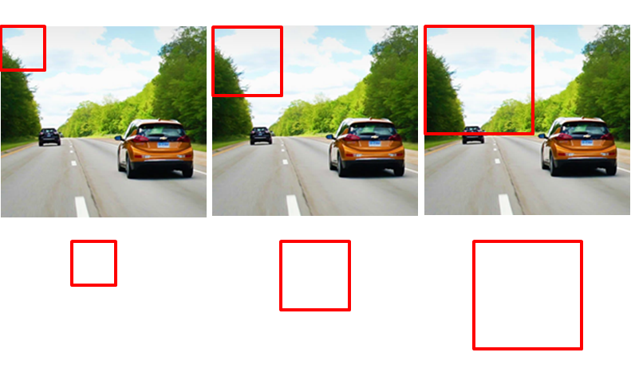



We have learned about [object localization](./object-localization) as well as [landmark detection](./landmark-detection), now let’s build an object detection algorithm. 
In this post we’ll learn how to use a convnet to perform object detection using **Sliding Windows Detection Algorithm**.

Let’s say we want to build a car detection algorithm.

1. We can first **_create a labelled training set (x,y) with closely cropped examples of cars_** and some other pictures that aren’t pictures of cars. We want to cut out such that we end up with a car centered in pretty much the entire image. Given this labelled training set we can then train a Convnet to classify an image as a car ($$y=1$$) or not ($$y=0$$).

2. **_Select a certain small window size._**

3. **_Put that window on the beginning of your test image. Classify the image inside the window a car ($$y=1$$) or not ($$y=0$$)_**, using the ConvNet that we trained in the previous step.

4. **_Shift your window and classify the new image inside the window._** Keep doing this until you cover the entire test image.

5. **_Increase the window size and repeat step 3 and 4_**. That is, classify the image inside the window, shift, classify again, so on and on.

6. **_Repeat step 5 until either you find an object or your window size is as big as the test image itself_**.

# Disadvantages of Sliding Window Detection
-  _High Computational cost_, because we’re cropping out so many different square regions in the image and running each of them independently through a convnet. 

# References
- Deeplearning.ai's CNN Course