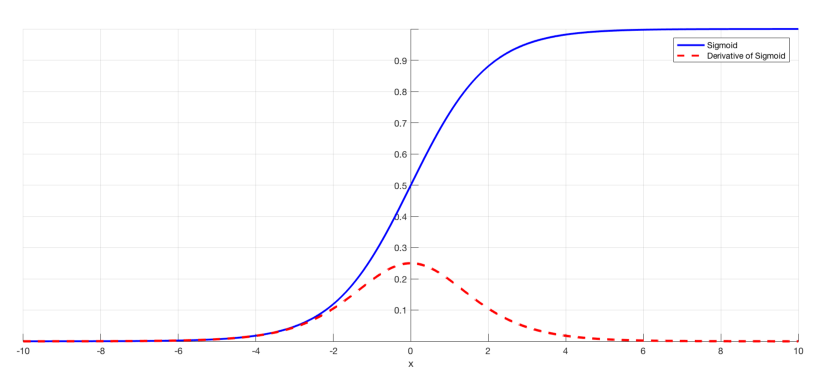
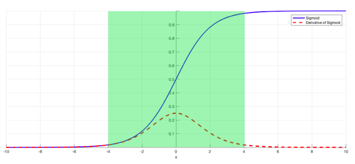



# The problem
As more layers using certain activation functions are added to neural networks, the gradients of the loss function approaches zero, making the network hard to train.

# Why
Certain activation functions, like the sigmoid function, squishes a large input space into a small input space between 0 and 1. Therefore, a large change in the input of the sigmoid function will cause a small change in the output. Hence, the derivative becomes small.

Above image plots the sigmoid function and its derivative. Note how, when the inputs of the sigmoid function becomes larger or smaller (when $$ \mid {x} \mid $$ becomes bigger), the derivative becomes close to zero.

# Why it’s significant

For shallow network with only a few layers that use these activations, this isn’t a big problem. However, when more layers are used, it can cause the gradient to be too small for training to work effectively.

Gradients of neural networks are found using backpropagation. Simply put, backpropagation finds the derivatives of the network by moving layer by layer from the final layer to the initial one. By the chain rule, the derivatives of each layer are multiplied down the network (from the final layer to the initial) to compute the derivatives of the initial layers.

`However, when n hidden layers use an activation like the sigmoid function, n small derivatives are multiplied together. Thus, the gradient decreases exponentially as we propagate down to the initial layers.`

A small gradient means that the weights and biases of the initial layers will not be updated effectively with each training session. Since these initial layers are often crucial to recognizing the core elements of the input data, it can lead to overall inaccuracy of the whole network.

# Solutions
The simplest solution is to use other activation functions, such as ReLU, which doesn’t cause a small derivative.

[Residual networks](./resnet) are another solution, as they provide residual connections straight to earlier layers.

Finally, batch normalization layers can also resolve the issue. As stated before, the problem arises when a large input space is mapped to a small one, causing the derivatives to disappear. In image above, this is most clearly seen at when $$ \mid x \mid $$ is big. Batch normalization reduces this problem by simply normalizing the input so $$ \mid x \mid $$ doesn’t reach the outer edges of the sigmoid function. As seen in image below, it normalizes the input so that most of it falls in the green region, where the derivative isn’t too small.

# References 

[https://towardsdatascience.com/the-vanishing-gradient-problem-69bf08b15484](https://towardsdatascience.com/the-vanishing-gradient-problem-69bf08b15484)