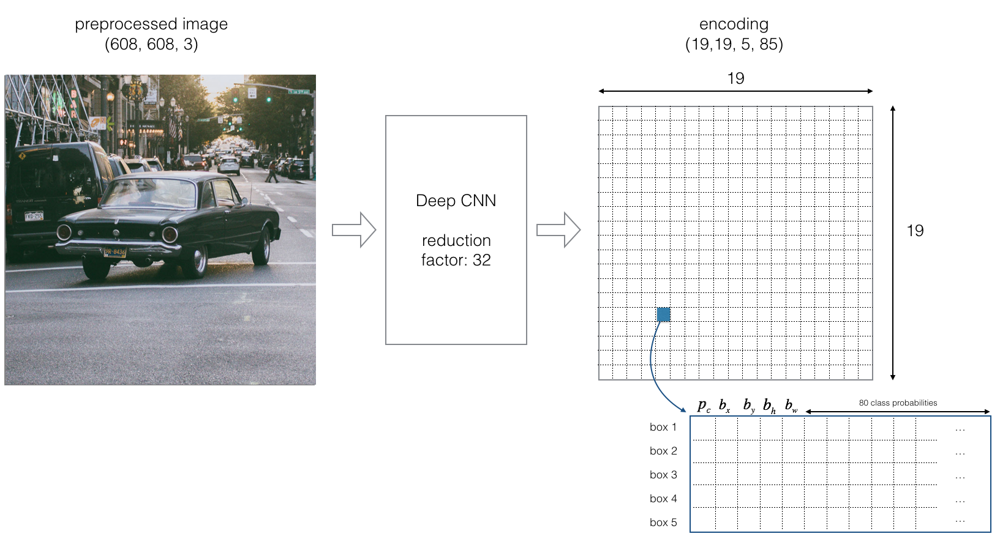



YOLO (“You Only Look Once”) is an effective real-time object recognition algorithm, first described in the seminal 2015 paper by Joseph Redmon et al. One of the algorithm’s open source implementations can be found [here](https://pjreddie.com/darknet/yolo).

"You Only Look Once" (YOLO) is a popular algorithm because it achieves high accuracy while also being able to run in real-time. This algorithm "only looks once" at the image in the sense that it requires only one forward propagation pass through the network to make predictions. After non-max suppression, it then outputs recognized objects together with the bounding boxes.

In this video, one of the authors of the YOLO paper explains it
<iframe width="560" height="315" src="https://www.youtube.com/embed/NM6lrxy0bxs" frameborder="0" allow="accelerometer; autoplay; clipboard-write; encrypted-media; gyroscope; picture-in-picture" allowfullscreen></iframe>

Before we go into YOLO's details we have to know what we are going to predict. Our task is to predict a class of an object and the bounding box specifying object location. Each bounding box can be described using four descriptors:

- center of a bounding box ($$ b_x,b_y $$)
- width ($$ b_w $$)
- height ($$ b_h $$)
- predicted value $$p_c$$ which is a probability that there is an object in the bounding box
value $$c$$ is corresponding to a class of an object (f.e. car, traffic lights,…).

YOLO algorithm we’re not searching for interested regions on our image that could contain some object. Instead of that we are splitting our image into cells, typically its $$19×19$$ grid. Each cell will be responsible for predicting 5 bounding boxes (in case there’s more than one object in this cell). This will give us 1805 bounding boxes for an image and that’s a really big number!

Majority of those cells and boxes won’t have an object inside and this is the reason why we need to predict $$p_c$$. In the next step, we’re removing boxes with low object probability and bounding boxes with the highest shared area in the process called **non-max suppression**.

# References

- [You Only Look Once: Unified, Real-Time Object Detection by Joseph Redmon et al](https://arxiv.org/abs/1506.02640)
- [https://appsilon.com/object-detection-yolo-algorithm/](https://appsilon.com/object-detection-yolo-algorithm/)
